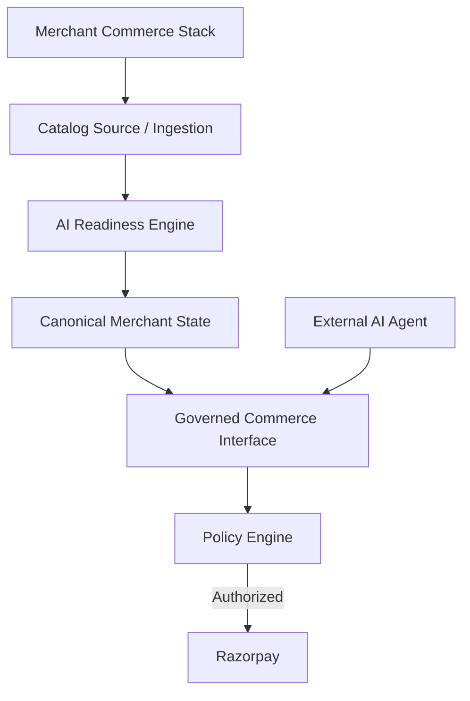

# Coastal

Coastal is a merchant-side AI commerce control plane.

Existing merchant commerce systems are designed primarily for human-driven shopping. Coastal makes an existing merchant commerce stack consumable by AI agents while keeping merchant policies and financial authority on the server side.

## The Problem

AI agents can reason about products and purchase intent, but giving an LLM direct access to merchant systems creates a trust and authorization problem. The merchant needs control over:

- authoritative product data
- inventory
- pricing
- order limits
- approval requirements
- payment execution

## What Coastal Does

1. **Merchant Readiness Workflow**: Merchant connects/imports commerce data (e.g., CSV). Data is normalized into a canonical merchant state. An AI readiness engine audits the catalog, variants, inventory, and policies. Safe deterministic corrections can be applied automatically, while ambiguous or commercially sensitive changes require merchant review. The merchant publishes the AI-ready state.
2. **AI Commerce Interface**: Once published, AI agents can consume an explicit commerce interface. 
3. **Policy Engine & Payment Flow**: Every consequential operation passes through the server-side policy engine. The LLM never becomes the authoritative source for price, inventory, totals, currency, or merchant policy. It simply selects tools and infers intent. Authorized transactions can proceed to Razorpay, and payment is only considered successful after server-side verification.

## Architecture



## Running Locally

To run Coastal on your local machine:

1. Copy the environment variables:
   ```bash
   cp .env.example .env
   ```
2. Open `.env` and set `GEMINI_API_KEY` to your Gemini API key.

3. Install dependencies and start the app:
   ```bash
   npm install
   npm run dev
   ```

## Testing

Run the test suite using `npm test`.

The test suite covers:
- Client-side price manipulation prevention
- Inventory manipulation protection
- Policy enforcement logic
- Denied checkouts (proving Razorpay is bypassed on failure)
- Payment verification safeguards
- Prompt injection safeguards against malicious merchant content
- Idempotency of iterative corrections
- CSV ingestion validation

## Security & Trust Model

- **LLM is not authoritative**: The model only orchestrates interactions and proposes corrections.
- **Merchant content is untrusted data**: Inputs are audited and sanitized against prompt injections.
- **Commerce state is server-authoritative**: Clients and AI agents fetch price/inventory dynamically from the server.
- **Policy decisions happen server-side**: Order limits and autonomous rules are enforced in the backend.
- **Razorpay is only reached after policy authorization**: Blocked transactions do not touch external financial services.
- **Payment is only trusted after verification**: Client-side success tokens are re-verified with Razorpay signatures.

*Note: This is a working prototype / hackathon project. Production integrations (such as persistent database storage and merchant authentication) are not currently implemented.*
