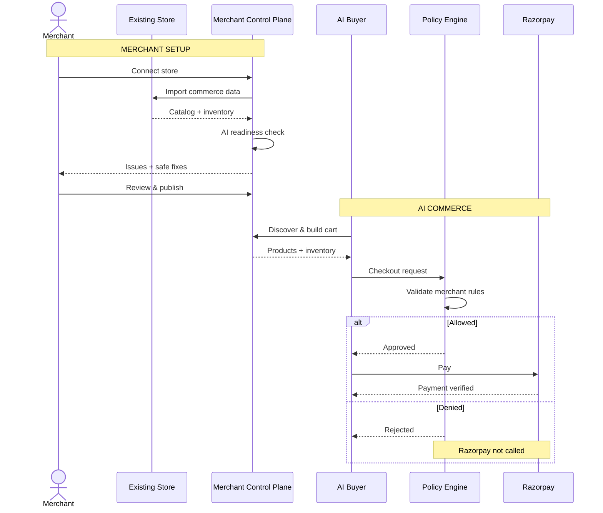

# Coastal

**Coastal** is a merchant-side commerce control plane designed to bridge existing retail architectures with autonomous AI agents. 

Modern commerce infrastructure is fundamentally optimized for human-driven, GUI-based shopping flows. Coastal provides a governed interface that exposes merchant catalogs and transaction endpoints to AI reasoning models, while enforcing strict server-side authority over pricing, inventory, and operational policies.

## Overview

The Coastal architecture introduces a trusted intermediary layer between external AI systems and the merchant's core operational data. It operates through two primary domains:

1. **Merchant Readiness Engine**: A normalization and auditing pipeline that ingests raw commerce data (e.g., CSV, Shopify). It performs deterministic validation, automated safe corrections, and surfaces ambiguous issues for manual merchant resolution before publishing a canonical, AI-ready state.
2. **Governed Commerce Interface & Policy Engine**: A secured API layer exposed to AI agents. It ensures that language models are restricted to reasoning and tool selection, delegating all financial authority, pricing logic, and transaction authorization to the server-side policy engine.

## System Architecture

The following sequence diagram outlines the operational lifecycle, from merchant onboarding to agent-driven checkout:



## Security & Trust Boundary

Coastal enforces a strict zero-trust model regarding external AI systems:

- **Non-Authoritative LLMs**: Language models are treated exclusively as reasoning engines. They propose state changes (via cart modifications or search queries) but possess no authority over final transaction values.
- **Server-Side Commerce State**: Price, inventory levels, currency configurations, and cart totals are dynamically fetched from the authoritative server backend and cannot be overridden by client or agent inputs.
- **Sanitization & Validation**: All merchant input and LLM-generated proposals are subject to prompt-injection sanitization and structural validation.
- **Pre-Authorization Policy Checks**: Checkouts are intercepted by the policy engine. Boundary limits (e.g., maximum order values) are evaluated server-side. Third-party financial services (Razorpay) are only invoked for transactions that strictly adhere to merchant policy.
- **Cryptographic Payment Verification**: Client-side success tokens from Razorpay are independently re-verified against backend signatures before an order is committed.

## Development Setup

The project is built using TypeScript, Node.js, and Vite.

### Prerequisites

```bash
# Clone and install dependencies
npm install

# Configure environment variables
cp .env.example .env
```
Ensure you populate `.env` with a valid `GEMINI_API_KEY` to enable the readiness engine and AI buyer integrations.

### Running the Application

```bash
# Start the local development server
npm run dev

# Compile TypeScript for production
npm run build
```

## Testing & Validation

The repository includes a comprehensive regression test suite verifying the integrity of the state machine, policy engine, and AI integrations.

```bash
npm test
```

Key test coverage includes:
- Verification of deterministic issue resolution and audit scoring idempotency.
- Validation of the Razorpay payment gateway bypass on policy denial.
- Assurance of client-side price and inventory manipulation safeguards.
- Sanitization of malformed or adversarial LLM responses within the readiness pipeline.

---
*Note: Coastal is provided as a reference implementation. Integration with persistent databases and robust merchant authentication systems is required before production deployment.*
