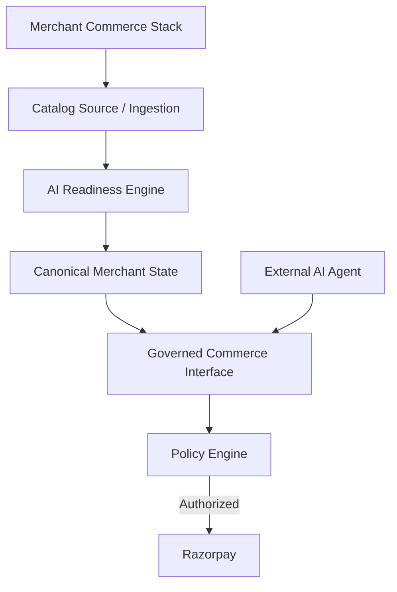

# Coastal

Coastal is a merchant-side AI commerce control plane.

Existing merchant commerce systems are designed primarily for human-driven shopping. Coastal makes an existing merchant commerce stack consumable by AI agents while keeping merchant policies and financial authority on the server side.

## The Problem

AI agents can reason about products and purchase intent, but giving an LLM direct access to merchant systems creates a trust and authorization problem.

The merchant needs control over:
- authoritative product data
- inventory
- pricing
- order limits
- approval requirements
- payment execution

## What Coastal Does

1. Merchant connects/imports commerce data.
2. Data is normalized into a canonical merchant state.
3. AI readiness audits the catalog, variants, inventory and policies.
4. Safe deterministic corrections can be applied automatically.
5. Ambiguous or commercially sensitive changes require merchant review.
6. The merchant publishes the AI-ready state.
7. AI agents consume an explicit commerce interface.
8. Every consequential operation passes through the server-side policy engine.
9. Authorized transactions can proceed to Razorpay.
10. Payment is only considered successful after server-side verification.

## Architecture



## Key Design Principle

**The AI handles reasoning. The server handles authority.**

The LLM never becomes the authoritative source for price, inventory, totals, currency, or merchant policy. It simply selects tools and infers intent.

## Demo

To see the system in action:
1. Import the merchant catalog (CSV format).
2. Run the AI readiness audit to find issues.
3. Automatically correct safe issues and manually resolve merchant review items.
4. Publish the AI commerce interface when the score reaches 90+.
5. Open the reference AI buyer (which demonstrates external consumption of the interface).
6. Search for a product, check inventory, and create a cart.
7. Checkout using the provided Razorpay Test Mode flow.
8. Wait for the server-side payment verification.
9. Try intentionally triggering a policy violation (e.g. max order value), and observe how the denied transaction never reaches Razorpay.

*(Note: The AI Buyer is a reference client provided to demonstrate how an external AI consumes the commerce interface. It is not the core product itself.)*

## Current Integrations

- **CSV**: Available
- **Shopify**: Planned
- **Merchant API**: Planned

## Tech Stack

- **TypeScript**: Core language for backend and frontend tooling.
- **Node.js**: Server runtime.
- **Vite**: Frontend dev server and bundler.
- **Gemini API**: AI LLM reasoning provider.
- **Razorpay API**: Payment gateway execution.
- **Papa Parse**: CSV ingestion parser.

## Running Locally

To run Coastal on your local machine:

```bash
# Install dependencies
npm install

# Start the development server
npm run dev

# Run automated tests
npm test

# Build the project
npm run build
```

### Environment Setup
You will need a `.env` file at the root of the project. You can copy the example configuration:
```bash
cp .env.example .env
```
Ensure that you provide a valid `GEMINI_API_KEY` inside `.env` to enable AI capabilities.

## Testing

Run the test suite using `npm test`.

The test suite covers:
- **Client-side price manipulation prevention**
- **Inventory manipulation protection**
- **Policy enforcement logic**
- **Denied checkouts** (proving Razorpay is bypassed on failure)
- **Payment verification safeguards**
- **Prompt injection safeguards** against malicious merchant content
- **Idempotency** of iterative corrections
- **CSV ingestion validation**

## Project Structure

```
├── src/
│   ├── buyer/        # Reference AI buyer agent
│   ├── commerce/     # Authoritative commerce API & policy engine
│   ├── readiness/    # AI Readiness audit & corrections workflow
│   ├── main.ts       # Frontend application entrypoint
│   └── server.ts     # Express server & API endpoints
├── test/             # Comprehensive regression test suite
└── data/             # Demo merchant data & CSV files
```

## Security & Trust Model

- **LLM is not authoritative**: The model only orchestrates interactions and proposes corrections.
- **Merchant content is untrusted data**: Inputs are audited and sanitized against prompt injections.
- **Commerce state is server-authoritative**: Clients and AI agents fetch price/inventory dynamically from the server.
- **Policy decisions happen server-side**: Order limits and autonomous rules are enforced in the backend.
- **Razorpay is only reached after policy authorization**: Blocked transactions do not touch external financial services.
- **Payment is only trusted after verification**: Client-side success tokens are re-verified with Razorpay signatures.

*Note: This is a working prototype / hackathon project. Production integrations (such as persistent database storage and merchant authentication) are not currently implemented.*
